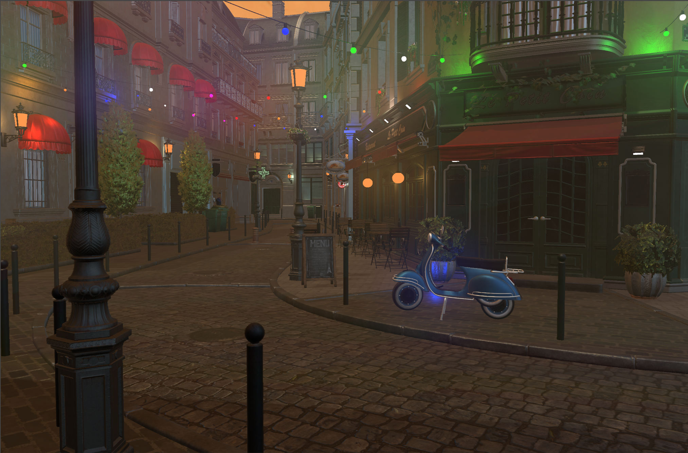
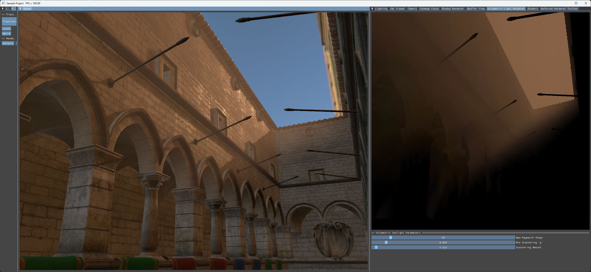
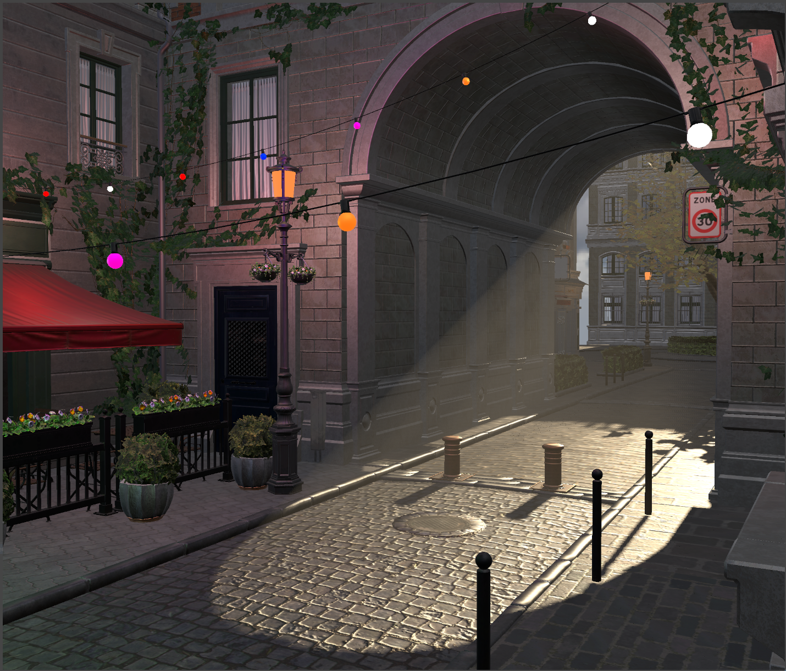

### Features
Deferred Shading with Light Volumes  
Normal Mapping  
Cascaded Shadow Mapping  
Image Based Lighting : Diffuse + Specular (Split Sum Approximation)  
Physically Based Direct Lighting (Microfacet model, Cook-Torrance)  
Volumetric Fog (Sunlight)

### Gallery
#### Bistro scene renderer with : deferred shading, physically based direct lighting, image based lighting, cascaded shadow mapping, volumetric fog (sunlight, point lights)

#### Sunlight Volumetric Lighting with previsualization

### References
[Normal Mapping Without Precomputed Tangents](http://www.thetenthplanet.de/archives/1180)  
Volumetric Light Effects in Killzone: Shadow Fall, GPU Pro 5  
[Real Shading in Unreal Engine 4](https://cdn2.unrealengine.com/Resources/files/2013SiggraphPresentationsNotes-26915738.pdf)  
[Cascaded Shadow Maps, DirectX Technical Articles](https://learn.microsoft.com/en-us/windows/win32/dxtecharts/cascaded-shadow-maps)  
[The Rendering Technology of KILLZONE 2](https://www.gdcvault.com/play/1330/The-Rendering-Technology-of-KILLZONE)  
[Compact Normal Storage for small G-Buffers](https://aras-p.info/texts/CompactNormalStorage.htm)  
