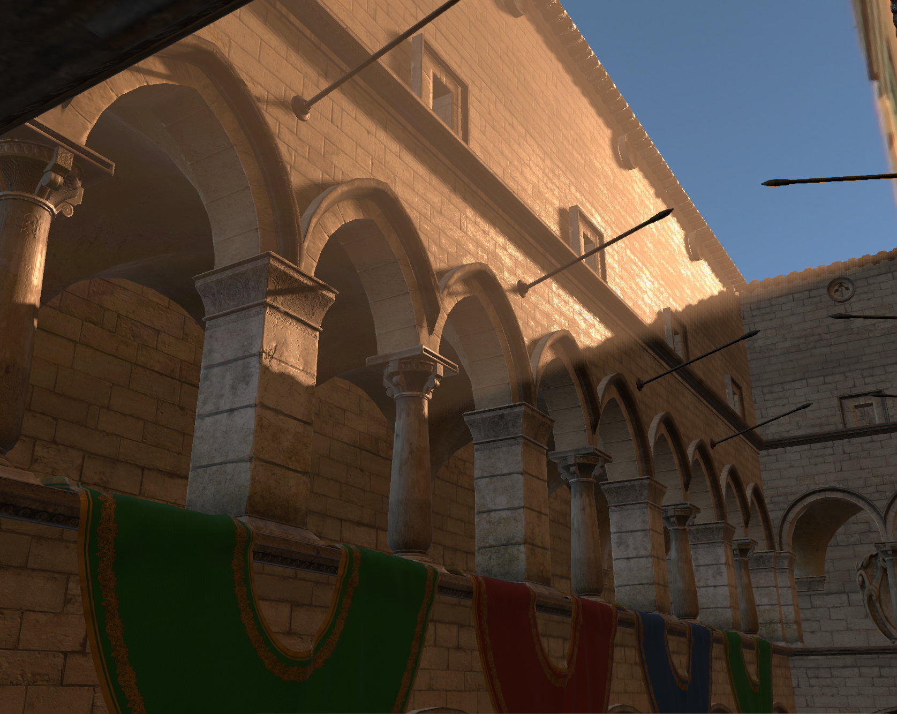
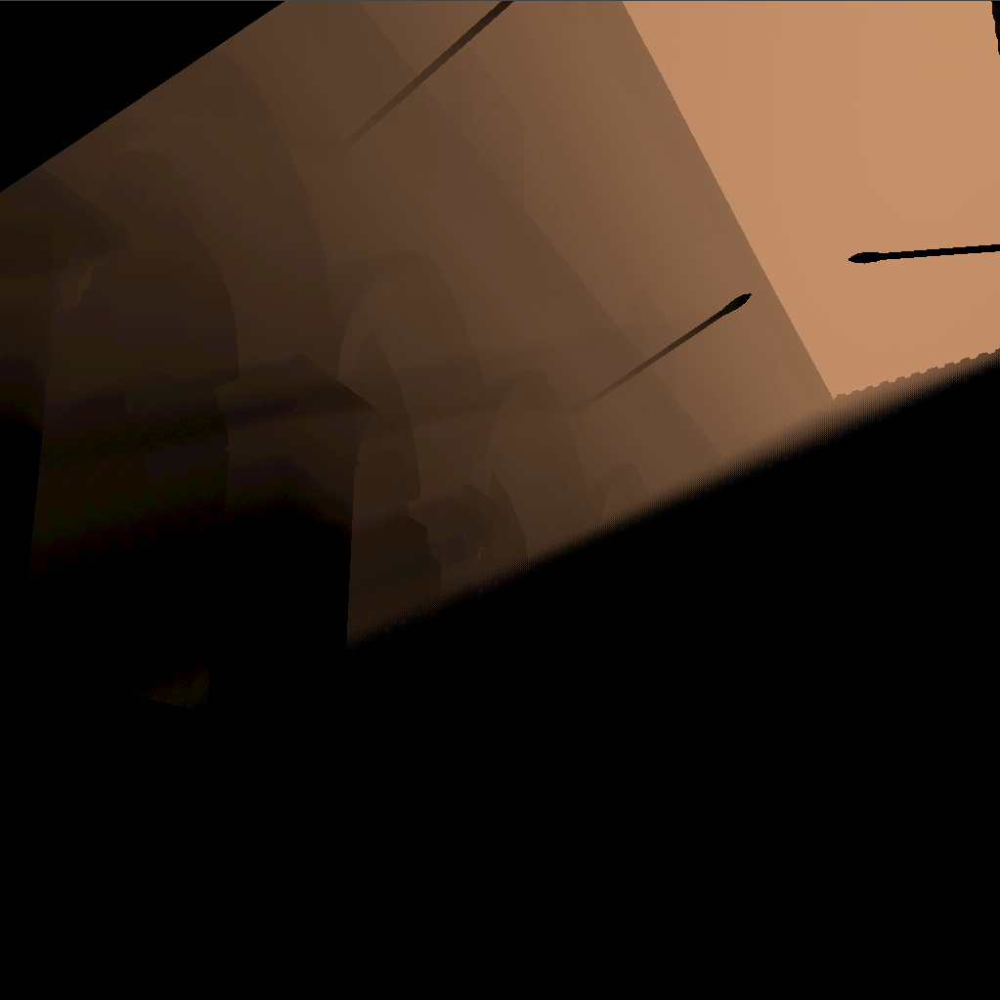

# About
Cardinalis is a Vulkan renderer written in C++.  

# Features
## Renderer
* Deferred Shading  
  * with optimization rendering light volumes for directional and point lights 
* Normal Mapping  
* Cascaded Shadow Mapping  
* Image Based Lighting  
  * Diffuse, Specular (Split Sum Approximation) prefiltering 
* PBR direct lighting  
  * Metallic/Roughness material model
  * Cook-Torrance BRDF
* Volumetric Lighting
  * Dithered Ray-marched sunlight scattering
  * Point lights
### Post-FX
* Gaussian blur
  * Compute shader based two-pass gaussian blur using separable property of gaussian filters
## Application
* Gltf file loading
  * Supports KHR_lights_punctual

# Gallery
 

# References
[Normal Mapping Without Precomputed Tangents](http://www.thetenthplanet.de/archives/1180)  
Volumetric Light Effects in Killzone: Shadow Fall, GPU Pro 5  
[Real Shading in Unreal Engine 4](https://cdn2.unrealengine.com/Resources/files/2013SiggraphPresentationsNotes-26915738.pdf)  
[Cascaded Shadow Maps, DirectX Technical Articles](https://learn.microsoft.com/en-us/windows/win32/dxtecharts/cascaded-shadow-maps)  
[The Rendering Technology of KILLZONE 2](https://www.gdcvault.com/play/1330/The-Rendering-Technology-of-KILLZONE)  
[Compact Normal Storage for small G-Buffers](https://aras-p.info/texts/CompactNormalStorage.htm)  
